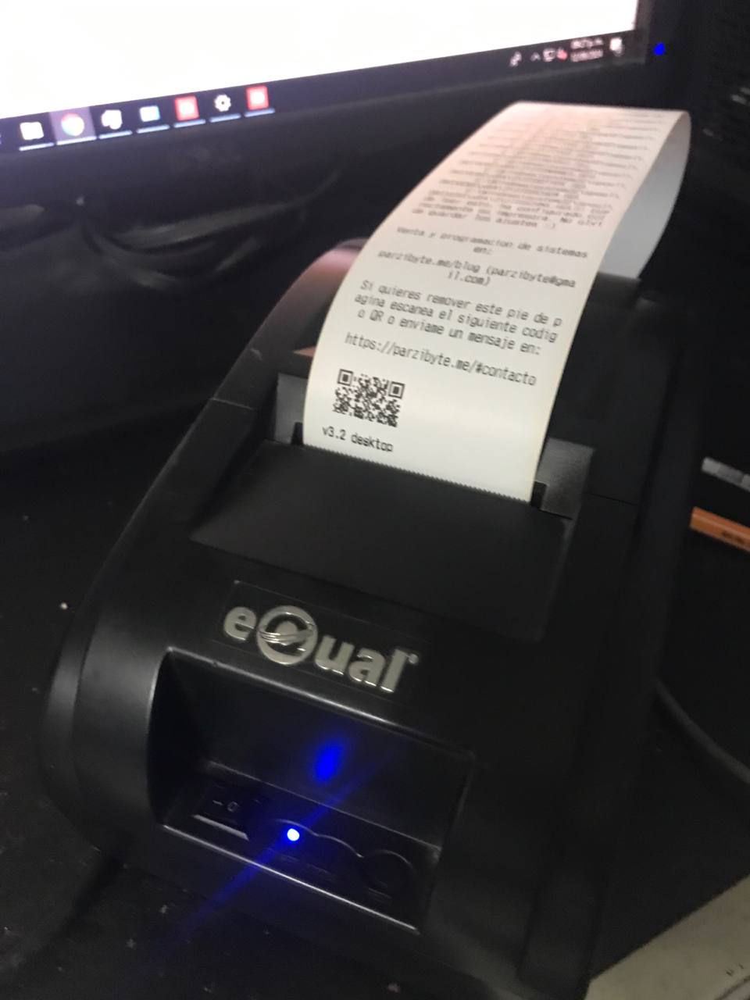

# Compatible printers
Here you will find a list of
thermal printers that work well
with this plugin. The plugin should be
compatible with any printer that supports
the ESC POS protocol

This list is not exhaustive, it only contains
the printers that users have reported. Just
because your printer does not appears here does not
mean that it is not compatible

| Printer name| Picture | Additional info |
|-- | -- | -- |
| Xprinter 58 |  | 
| GOOJPRT PT-210 MTP-II | | 
| Equal IT-003|  | |
| 3nstar  | | |
| BTS-T80B | | |
| POS-58 D|  | |