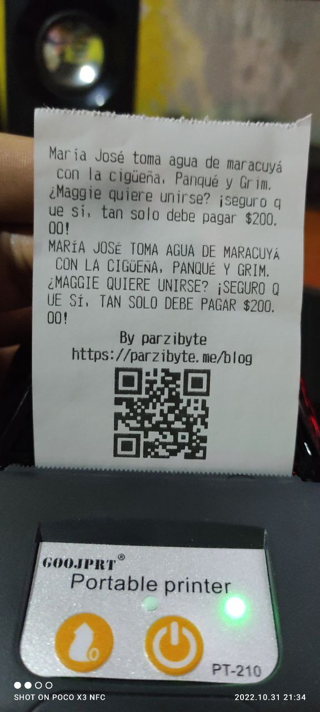

# Impresoras compatibles
Aquí encontrarás una lista de impresoras térmicas que funcionan bien con este plugin. El plugin debería ser compatible con cualquier impresora que soporte el protocolo ESC POS.

Esta lista no es exhaustiva, solo contiene las impresoras que los usuarios han reportado. Si tu impresora no aparece aquí, no significa que no sea compatible.

| Modelo de impresora ESC POS | Foto | Información adicional |
|-- | -- | -- |
| Xprinter 58 |  | 
| GOOJPRT PT-210 MTP-II | | 
| Equal IT-003|  | |
| 3nstar  | | |
| BTS-T80B | | |
| POS-58 D|  | |
| Bixolon SRP-350 |  | |
| Digital POS DIG - E200I|  | |
| BT-80UBW |  | |
| POS-5890F |  | |
| Epson TM-m30 |  | |
| SAT 38TUSE |  | |
| EPSON TM-20 |  | |
| Miniprinter Epson Tmt20iii-001 Usb Serial Termica C31ch51001 |  | |
| Epson TM-T20III|  | |